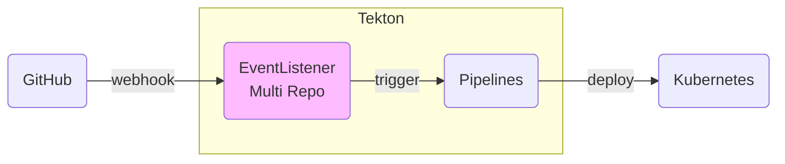
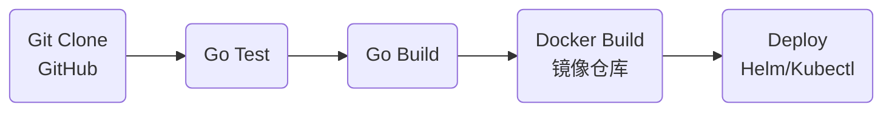

接上一篇 [【Tekton】组件介绍及安装部署](/post/devops/2021-03-28-tekton-install/)，本文介绍如何使用 Tekton 完成 CI/CD 的全流程，包括 WebHook、代码拉取、go test、go build、docker build and push、helm/kubectl k8s 部署，其中涉及 Git/镜像仓库的 Basic 认证、kubeconfig、以及 go mod 缓存和多项目目录结构等实践内容。

<!--more-->

首先看下本文实践的 CI/CD 全部流程：



- Pipelines



> 示例源码：[github.com/hb-chen/tekton-practice](https://github.com/hb-chen/tekton-practice)

内容如下：

- GitHub 仓库通过 Webhook 触发流水线
- 支持多项目构建
- 多个项目共用 PVC，通过子目录区分
- EventListener 接收 Webhook 后根据 Repo 信息区分项目，并触发不同的 Pipeline
- 流水线完成仓库的 克隆、test、build、镜像构建、发布到 K8S 平台
- 指定 go mod 目录，避免每次重新拉取依赖，做构建缓存
- 秘钥配置
  - Webhook 秘钥配置
  - Git 仓库 Basic 认证
  - Docker Hub Basic 认证
  - K8S kubeConfig


## Webhook 触发器

首先从 Trigger 开始，触发器对应的 `CRD` 为 `EventListener`，由 `TriggerController` 负责 `EL` 实例的生命周期管理，`EL` 为接收 Webhook 的服务。相关的 `CRD` 还有 `TriggerBinding` 和`TriggerTemplate`，`TriggerBinding` 用于将 Webhook 请求的数据映射到 `TriggerTemplate` 的输入参数；`TriggerTemplate` 则用于定义触发器所要运行的流水线，有关 Triiger 的文档参考 [Triggers and EventListeners](https://tekton.dev/docs/triggers/)。具体 `CRD` 如下：

- `kind: Secret`: `github-secret` 定义 Webhook 接口所需要的秘钥

- `kind: EventListener`: `github-listener-interceptor` 主要在 `triggers` 中分别定义两个 GitHub 项目的 trigger

  - `interceptors` 中用 `github` 关联了 Webhook 需要的 `secret`，用 `cel.filter` 过滤指定项目的 Repo，用于测试的两个用例分别为 [hb-chen/gateway](https://github.com/hb-chen/gateway) 和 [hb-chen/gmqtt](https://github.com/hb-chen/gmqtt)

  - `template` 和 `bindings` 分别用于关联 `TriggerTemplate` 和 `TriggerBinding`

  - > Trigger 也可以通过单独 CRD 来定义，用 `triggerRef` 来关联

- `kind: TriggerBinding`: 仅从 body 中获取了 Repo 地址，更多信息可以根据 Template 的需求情况进行绑定

- `kind: TriggerTemplate`: 分别定义了两个项目的流水线模板，在触发器出发后使用 `resourcetemplates` 创建资源，并可以通过 `params` 定义模板参数，结合 `TriggerBinding` 便可以获取 Webhook 接口 Request 中的信息

```yaml
---
apiVersion: v1
kind: Secret
metadata:
  name: github-secret
type: Opaque
stringData:
	# Webhook 所用的 secret
  secretToken: "123456"
---
apiVersion: triggers.tekton.dev/v1alpha1
kind: EventListener
metadata:
  name: github-listener-interceptor
spec:
  triggers:
    - name: github-gateway-listener
      interceptors:
        - github:
        		# 绑定 Webhook 所用的 secret
            secretRef:
              secretName: github-secret
              secretKey: secretToken
            eventTypes:
        # CEL filter 表达式过滤指定 repo
        - cel:
            filter: "body.repository.full_name in ['hb-chen/gateway']"
      bindings:
        - ref: pipeline-binding
      template:
        ref: grpc-gateway-pipeline-template
    - name: github-gmqtt-listener
      interceptors:
        - github:
        		# 绑定 Webhook 所用的 secret
            secretRef:
              secretName: github-secret
              secretKey: secretToken
            eventTypes:
        # CEL filter 表达式过滤指定 repo
        - cel:
            filter: "body.repository.full_name in ['hb-chen/gmqtt']"
      bindings:
        - ref: pipeline-binding
      template:
        ref: gmqtt-pipeline-template
  resources:
    kubernetesResource:
      spec:
        template:
          spec:
            serviceAccountName: tekton-triggers-example-sa
            containers:
              - resources:
                  requests:
                    memory: "64Mi"
                    cpu: "250m"
                  limits:
                    memory: "128Mi"
                    cpu: "500m"
---
apiVersion: triggers.tekton.dev/v1alpha1
kind: TriggerBinding
metadata:
  name: pipeline-binding
spec:
	# 从 Webhook 的接口请求中获取参数
  params:
    - name: gitrepositoryurl
      value: $(body.repository.clone_url)
---
apiVersion: triggers.tekton.dev/v1alpha1
kind: TriggerTemplate
metadata:
  name: grpc-gateway-pipeline-template
spec:
	# 定义模板参数
  params:
    - name: gitrevision
      description: The git revision
      default: master
    - name: gitrepositoryurl
      description: The git repository url
  # 触发后所要创建的 CRD 资源模板
  resourcetemplates:
    - apiVersion: tekton.dev/v1beta1
      kind: PipelineRun
      metadata:
        generateName: grpc-gateway-pipeline-run-
      spec:
        serviceAccountName: build-bot
        pipelineRef:
          name: grpc-gateway-pipeline
        workspaces:
          - name: shared-workspace
            persistentvolumeclaim:
              claimName: golang-source-pvc
        params:
          - name: url
            value: $(tt.params.gitrepositoryurl)
          - name: revision
            value: $(tt.params.gitrevision)
---
apiVersion: triggers.tekton.dev/v1alpha1
kind: TriggerTemplate
metadata:
  name: gmqtt-pipeline-template
spec:
	# 定义模板参数
  params:
    - name: gitrevision
      description: The git revision
      default: master
    - name: gitrepositoryurl
      description: The git repository url
  # 触发后所要创建的 CRD 资源模板
  resourcetemplates:
    - apiVersion: tekton.dev/v1beta1
      kind: PipelineRun
      metadata:
        generateName: gmqtt-pipeline-run-
      spec:
        serviceAccountName: build-bot
        pipelineRef:
          name: gmqtt-pipeline
        workspaces:
          - name: shared-workspace
            persistentvolumeclaim:
              claimName: golang-source-pvc
        params:
          - name: url
            value: $(tt.params.gitrepositoryurl)
          - name: revision
            value: $(tt.params.gitrevision)
```

### RBAC

前面有了 Trigger 相关的资源，最后还缺一个 `ServiceAccount` ，并且需要做相应的 `RBAC` 授权，主要包括：

- `triggers.tekton.dev` 相关 `CRD` 资源获取

- 允许创建的 `CRD` 资源

  - > Trigger 是 Tekton 的一个独立组件，`TriggerTemplate` 可以用来创建各类 `CRD` 资源，自然要有相应资源的 `create` 权限才行

```yaml
apiVersion: v1
kind: ServiceAccount
metadata:
  name: tekton-triggers-example-sa
---
apiVersion: rbac.authorization.k8s.io/v1
kind: Role
metadata:
  name: tekton-triggers-example-minimal
rules:
  # EventListeners need to be able to fetch all namespaced resources
  - apiGroups: ["triggers.tekton.dev"]
    resources: ["eventlisteners", "triggerbindings", "triggertemplates", "triggers"]
    verbs: ["get", "list", "watch"]
  - apiGroups: [""]
    # secrets are only needed for GitHub/GitLab interceptors
    # configmaps is needed for updating logging config
    resources: ["configmaps", "secrets"]
    verbs: ["get", "list", "watch"]
  # Permissions to create resources in associated TriggerTemplates
  - apiGroups: ["tekton.dev"]
    resources: ["pipelineruns", "pipelineresources", "taskruns"]
    verbs: ["create"]
  - apiGroups: [""]
    resources: ["serviceaccounts"]
    verbs: ["impersonate"]
---
apiVersion: rbac.authorization.k8s.io/v1
kind: RoleBinding
metadata:
  name: tekton-triggers-example-binding
subjects:
  - kind: ServiceAccount
    name: tekton-triggers-example-sa
roleRef:
  apiGroup: rbac.authorization.k8s.io
  kind: Role
  name: tekton-triggers-example-minimal
---
kind: ClusterRole
apiVersion: rbac.authorization.k8s.io/v1
metadata:
  name: tekton-triggers-example-clusterrole
rules:
  # EventListeners need to be able to fetch any clustertriggerbindings
  - apiGroups: ["triggers.tekton.dev"]
    resources: ["clustertriggerbindings"]
    verbs: ["get", "list", "watch"]
---
apiVersion: rbac.authorization.k8s.io/v1
kind: ClusterRoleBinding
metadata:
  name: tekton-triggers-example-clusterbinding
subjects:
  - kind: ServiceAccount
    name: tekton-triggers-example-sa
    namespace: tekton-pipelines
roleRef:
  apiGroup: rbac.authorization.k8s.io
  kind: ClusterRole
  name: tekton-triggers-example-clusterrole
```

## 流水线任务

Task 主要参考官方的 [catalog](https://github.com/tektoncd/catalog)，结合自身需求做了适当的改造，详细内容如下：

- 增加了 `GOPROXY` 和 `GOMODCACHE` 的支持，加速依赖下载速度，使用国内 Proxy，并将 mod cache 指定到 `workspace` 的独立目录，多个项目共享且避免被清理，路径为 `$(workspaces.source.path)/$(params.GOMODCACHE)`， `GOMODCACHE` 参数默认为 `pkg/mod`

- 增加对子目录的支持，在同一 `workspace` 下同时存储多个项目的源码

  - > 未必是个好的实践方式，不过适合我的需求😂

- 镜像构建选用的 `kaniko` 而没有用 `docker-build`，都尝试后发现用 `kaniko` 可以比较方便的获取 `image digested`

- 发布到 `k8s` 没有使用 `catalog` 中的 Task，而是使用 `dtzar/helm-kubectl` 镜像自己定义的一个 Task，可以自定义 `helm` 或 `kubectl` 命令

> 每个 Task 的具体工作在此不做详细的介绍，基本通过源码的参数和步骤可以很快了解每个 Task 的具体任务内容

### git-clone.yml

```yaml
apiVersion: tekton.dev/v1beta1
kind: Task
metadata:
  name: git-clone
  labels:
    app.kubernetes.io/version: "0.2"
  annotations:
    tekton.dev/pipelines.minVersion: "0.12.1"
    tekton.dev/tags: git
    tekton.dev/displayName: "git clone"
spec:
  description: >-
    These Tasks are Git tasks to work with repositories used by other tasks
    in your Pipeline.

    The git-clone Task will clone a repo from the provided url into the
    output Workspace. By default the repo will be cloned into the root of
    your Workspace. You can clone into a subdirectory by setting this Task's
    subdirectory param.

  workspaces:
    - name: output
      description: The git repo will be cloned onto the volume backing this workspace
  params:
    - name: url
      description: git url to clone
      type: string
    - name: revision
      description: git revision to checkout (branch, tag, sha, ref…)
      type: string
      default: ""
    - name: refspec
      description: (optional) git refspec to fetch before checking out revision
      default: ""
    - name: submodules
      description: defines if the resource should initialize and fetch the submodules
      type: string
      default: "true"
    - name: depth
      description: performs a shallow clone where only the most recent commit(s) will be fetched
      type: string
      default: "1"
    - name: sslVerify
      description: defines if http.sslVerify should be set to true or false in the global git config
      type: string
      default: "true"
    - name: subdirectory
      description: subdirectory inside the "output" workspace to clone the git repo into
      type: string
      default: ""
    - name: deleteExisting
      description: clean out the contents of the repo's destination directory (if it already exists) before trying to clone the repo there
      type: string
      default: "true"
    - name: httpProxy
      description: git HTTP proxy server for non-SSL requests
      type: string
      default: ""
    - name: httpsProxy
      description: git HTTPS proxy server for SSL requests
      type: string
      default: ""
    - name: noProxy
      description: git no proxy - opt out of proxying HTTP/HTTPS requests
      type: string
      default: ""
    - name: verbose
      description: log the commands used during execution
      type: string
      default: "true"
    - name: gitInitImage
      description: the image used where the git-init binary is
      type: string
      default: "registry.cn-hangzhou.aliyuncs.com/hb-chen/tektoncd-git-init:v0.20.0@sha256:e8e38d1ad630cc2e435deed289b6283cb0a06d3c00947131f371f151781db2b3"
  results:
    - name: commit
      description: The precise commit SHA that was fetched by this Task
    - name: url
      description: The precise URL that was fetched by this Task
  steps:
    - name: clone
      image: $(params.gitInitImage)
      script: |
        #!/bin/sh
        set -eu -o pipefail

        if [[ "$(params.verbose)" == "true" ]] ; then
          set -x
        fi

        CHECKOUT_DIR="$(workspaces.output.path)/$(params.subdirectory)"

        cleandir() {
          # Delete any existing contents of the repo directory if it exists.
          #
          # We don't just "rm -rf $CHECKOUT_DIR" because $CHECKOUT_DIR might be "/"
          # or the root of a mounted volume.
          if [[ -d "$CHECKOUT_DIR" ]] ; then
            # Delete non-hidden files and directories
            rm -rf "$CHECKOUT_DIR"/*
            # Delete files and directories starting with . but excluding ..
            rm -rf "$CHECKOUT_DIR"/.[!.]*
            # Delete files and directories starting with .. plus any other character
            rm -rf "$CHECKOUT_DIR"/..?*
          fi
        }

        if [[ "$(params.deleteExisting)" == "true" ]] ; then
          cleandir
        fi

        test -z "$(params.httpProxy)" || export HTTP_PROXY=$(params.httpProxy)
        test -z "$(params.httpsProxy)" || export HTTPS_PROXY=$(params.httpsProxy)
        test -z "$(params.noProxy)" || export NO_PROXY=$(params.noProxy)

        /ko-app/git-init \
          -url "$(params.url)" \
          -revision "$(params.revision)" \
          -refspec "$(params.refspec)" \
          -path "$CHECKOUT_DIR" \
          -sslVerify="$(params.sslVerify)" \
          -submodules="$(params.submodules)" \
          -depth "$(params.depth)"
        cd "$CHECKOUT_DIR"
        RESULT_SHA="$(git rev-parse HEAD)"
        EXIT_CODE="$?"
        if [ "$EXIT_CODE" != 0 ] ; then
          exit $EXIT_CODE
        fi
        # ensure we don't add a trailing newline to the result
        echo -n "$RESULT_SHA" > $(results.commit.path)
        echo -n "$(params.url)" > $(results.url.path)
```

### golang-test.yml

```yaml
apiVersion: tekton.dev/v1beta1
kind: Task
metadata:
  name: golang-test
  labels:
    app.kubernetes.io/version: "0.1"
  annotations:
    tekton.dev/pipelines.minVersion: "0.12.1"
    tekton.dev/tags: test
    tekton.dev/displayName: "golang test"
spec:
  description: >-
    This Task is Golang task to test Go projects.

  params:
    - name: package
      description: package (and its children) under test
    - name: packages
      description: "packages to test (default: ./...)"
      default: "./..."
    - name: subdirectory
      description: subdirectory inside the "source"
      type: string
      default: ""
    - name: version
      description: golang version to use for tests
      default: "latest"
    - name: flags
      description: flags to use for the test command
      default: -race -cover -v
    - name: GOOS
      description: "running program's operating system target"
      default: linux
    - name: GOARCH
      description: "running program's architecture target"
      default: amd64
    - name: GO111MODULE
      description: "value of module support"
      default: auto
    - name: GOPROXY
      description: "go proxy"
      default: "https://mirrors.aliyun.com/goproxy/,direct"
    - name: GOMODCACHE
      description: "go mod cache sub directory, base on source path"
      default: "pkg/mod"
  workspaces:
    - name: source
  steps:
    - name: unit-test
      image: docker.io/library/golang:$(params.version)
      script: |
        SRC_PATH="$GOPATH/src/$(params.package)"
        mkdir -p $SRC_PATH
        cp -R "$(workspaces.source.path)"/$(params.subdirectory)/* $SRC_PATH
        cd $SRC_PATH
        go test $(params.flags) $(params.packages)
      env:
        - name: GOOS
          value: "$(params.GOOS)"
        - name: GOARCH
          value: "$(params.GOARCH)"
        - name: GO111MODULE
          value: "$(params.GO111MODULE)"
        - name: GOPROXY
          value: "$(params.GOPROXY)"
        - name: GOMODCACHE
          value: "$(workspaces.source.path)/$(params.GOMODCACHE)"
```

### golang-build.yml

```yaml
# fork from tektoncd/catalog, add GOPROXY
apiVersion: tekton.dev/v1beta1
kind: Task
metadata:
  name: golang-build
  labels:
    app.kubernetes.io/version: "0.1"
  annotations:
    tekton.dev/pipelines.minVersion: "0.12.1"
    tekton.dev/tags: build-tool
    tekton.dev/displayName: "golang build"
spec:
  description: >-
    This Task is Golang task to build Go projects.

  params:
    - name: package
      description: base package to build in
    - name: packages
      description: "packages to build (default: ./cmd/...)"
      default: "./cmd/..."
    - name: subdirectory
      description: subdirectory inside the "source"
      type: string
      default: ""
    - name: version
      description: golang version to use for builds
      default: "latest"
    - name: flags
      description: flags to use for the test command
      default: -v
    - name: GOOS
      description: "running program's operating system target"
      default: linux
    - name: GOARCH
      description: "running program's architecture target"
      default: amd64
    - name: CGO_ENABLED
      description: "value of cgo enabled"
      default: "0"
    - name: GO111MODULE
      description: "value of module support"
      default: auto
    - name: GOPROXY
      description: "go proxy"
      default: "https://mirrors.aliyun.com/goproxy/,direct"
    - name: GOMODCACHE
      description: "go mod cache sub directory, base on source path"
      default: "pkg/mod"
  workspaces:
    - name: source
  steps:
    - name: build
      image: docker.io/library/golang:$(params.version)
      script: |
        SRC_PATH="$GOPATH/src/$(params.package)"
        mkdir -p $SRC_PATH
        cp -R "$(workspaces.source.path)"/$(params.subdirectory)/* $SRC_PATH
        cd $SRC_PATH
        go env
        go build $(params.flags) $(params.packages)
      env:
        - name: GOOS
          value: "$(params.GOOS)"
        - name: GOARCH
          value: "$(params.GOARCH)"
        - name: CGO_ENABLED
          value: "$(params.CGO_ENABLED)"
        - name: GO111MODULE
          value: "$(params.GO111MODULE)"
        - name: GOPROXY
          value: "$(params.GOPROXY)"
        - name: GOMODCACHE
          value: "$(workspaces.source.path)/$(params.GOMODCACHE)"
```

### kaniko.yml

```yaml
# fork from tektoncd/kaniko, add insecure_registry
apiVersion: tekton.dev/v1beta1
kind: Task
metadata:
  name: kaniko
  labels:
    app.kubernetes.io/version: "0.1"
  annotations:
    tekton.dev/pipelines.minVersion: "0.12.1"
    tekton.dev/tags: image-build
spec:
  description: >-
    This Task builds source into a container image using Google's kaniko tool.

    Kaniko doesn't depend on a Docker daemon and executes each
    command within a Dockerfile completely in userspace. This enables
    building container images in environments that can't easily or
    securely run a Docker daemon, such as a standard Kubernetes cluster.

  params:
    - name: IMAGE
      description: Name (reference) of the image to build.
    - name: DOCKERFILE
      description: Path to the Dockerfile to build.
      default: ./Dockerfile
    - name: CONTEXT
      description: The build context used by Kaniko.
      default: ./
    - name: EXTRA_ARGS
      default: ""
    - name: BUILDER_IMAGE
      description: The image on which builds will run
      default: registry.cn-hangzhou.aliyuncs.com/hb-chen/kaniko-executor@sha256:e36c9fa99279217c4bb8ee172819b441c3ca8ef946dc0e28b21721eefb2ba70a
    - name: insecure_registry
      description: Allows the user to push to an insecure registry that has been specified
      default: ""
  workspaces:
    - name: source
  results:
    - name: IMAGE-DIGEST
      description: Digest of the image just built.

  steps:
    - name: build-and-push
      workingDir: $(workspaces.source.path)
      image: $(params.BUILDER_IMAGE)
      # specifying DOCKER_CONFIG is required to allow kaniko to detect docker credential
      # https://github.com/tektoncd/pipeline/pull/706
      env:
        - name: DOCKER_CONFIG
          value: /tekton/home/.docker
      command:
        - /kaniko/executor
        - $(params.EXTRA_ARGS)
        - --dockerfile=$(params.DOCKERFILE)
        - --context=$(workspaces.source.path)/$(params.CONTEXT)  # The user does not need to care the workspace and the source.
        - --destination=$(params.IMAGE)
        - --oci-layout-path=$(workspaces.source.path)/$(params.CONTEXT)/image-digest
      #  - --insecure-registry=$(params.insecure_registry)
      # kaniko assumes it is running as root, which means this example fails on platforms
      # that default to run containers as random uid (like OpenShift). Adding this securityContext
      # makes it explicit that it needs to run as root.
      securityContext:
        runAsUser: 0
    - name: write-digest
      workingDir: $(workspaces.source.path)
      image: registry.cn-hangzhou.aliyuncs.com/hb-chen/tektoncd-imagedigestexporter:v0.16.2@sha256:542d437868a0168f0771d840233110fbf860b210b0e9becce5d75628c694b958
      # output of imagedigestexport [{"key":"digest","value":"sha256:eed29..660","resourceRef":{"name":"myrepo/myimage"}}]
      command: ["/ko-app/imagedigestexporter"]
      args:
        - -images=[{"name":"$(params.IMAGE)","type":"image","url":"$(params.IMAGE)","digest":"","OutputImageDir":"$(workspaces.source.path)/$(params.CONTEXT)/image-digest"}]
        - -terminationMessagePath=$(params.CONTEXT)/image-digested
      securityContext:
        runAsUser: 0
    - name: digest-to-results
      workingDir: $(workspaces.source.path)
      image: docker.io/stedolan/jq@sha256:a61ed0bca213081b64be94c5e1b402ea58bc549f457c2682a86704dd55231e09
      script: |
        cat $(params.CONTEXT)/image-digested | jq '.[0].value' -rj | tee /tekton/results/IMAGE-DIGEST
```

### helm-kubectl.yml

```yaml
apiVersion: tekton.dev/v1beta1
kind: Task
metadata:
  name: helm-kubectl-deploy
  labels:
    app.kubernetes.io/version: "0.1"
  annotations:
    tekton.dev/pipelines.minVersion: "0.12.1"
    tekton.dev/tags: helm, kubectl
    tekton.dev/displayName: helm-kubectl-deploy
spec:
  description: >-
    Use kubectl and helm deploy application
  params:
    - name: image
      default: dtzar/helm-kubectl:3.4.2
      description: kubectl and helm image
    - name: kubeconfig
      default: k8s-kubeconfig
      description: kubernetes cluster kubeconfig
    - name: commands
      default: kubectl version
  workspaces:
    - name: source
  results:
  steps:
    - name: helm-kubectl-deploy
      image: $(params.image)
      workingDir: $(workspaces.source.path)
      script: |
        pwd
        ls -l
        $(params.commands)
      volumeMounts:
        - name: kubeconfig
          mountPath: "/tekton/home/.kube"
          readOnly: true
  volumes:
    - name: kubeconfig
      secret:
        secretName: $(params.kubeconfig)
```

## 流水线定义

Pipeline 基本就是对 Task 的配置，其中最主要的就是根据项目区分 `workspace` 下的子目录：

- 统一 `subdirectory`
- Golang build 编译的输出位置`-o $(workspaces.source.path)/${subdirectory}`
- 镜像构建的 `DOCKERFILE` 和 `CONTEXT` 也是在 `./${subdirectory}/`目录下
- `helm` 部署时 `chart` 也是在`./${subdirectory}/`

以下是 [hb-chen/gateway](https://github.com/hb-chen/gateway) 的示例：

```yaml
---
apiVersion: tekton.dev/v1beta1
kind: Pipeline
metadata:
  name: grpc-gateway-pipeline
spec:
  workspaces:
    - name: shared-workspace
  params:
    - name: url
    - name: revision
      default: master
  tasks:
    - name: fetch-repository
      taskRef:
        name: git-clone
      workspaces:
        - name: output
          workspace: shared-workspace
      params:
        - name: url
          value: $(params.url)
        - name: revision
          value: $(params.revision)
        - name: subdirectory
          value: "gateway"
        - name: deleteExisting
          value: "true"
    - name: run-test
      taskRef:
        name: golang-test
      runAfter:
        - fetch-repository
      workspaces:
        - name: source
          workspace: shared-workspace
      params:
        - name: package
          value: github.com/hb-chen/gateway
        - name: subdirectory
          value: "gateway"
        - name: version
          value: 1.14.15
    - name: run-build
      taskRef:
        name: golang-build
      runAfter:
        - run-test
      workspaces:
        - name: source
          workspace: shared-workspace
      params:
        - name: package
          value: github.com/hb-chen/gateway
        - name: subdirectory
          value: "gateway"
        - name: version
          value: 1.15.11
        - name: flags
          value: -v -o $(workspaces.source.path)/gateway/bin/gateway
    - name: docker-build
      taskRef:
        name: kaniko
      runAfter:
        - run-build
      workspaces:
        - name: source
          workspace: shared-workspace
      params:
        - name: IMAGE
          value: registry.cn-hangzhou.aliyuncs.com/hb-chen/grpc-gateway:latest
        - name: DOCKERFILE
          value: ./gateway/Dockerfile
        - name: CONTEXT
          value: ./gateway/
        - name: EXTRA_ARGS
          value: "--skip-tls-verify"
        - name: insecure_registry
          value: registry.cn-hangzhou.aliyuncs.com
    - name: helm-kubectl-deploy
      taskRef:
        name: helm-kubectl-deploy
      runAfter:
        - docker-build
      workspaces:
        - name: source
          workspace: shared-workspace
      params:
        - name: commands
          value: helm upgrade --install grpc-gateway ./gateway/helm --namespace grpc-gateway --no-hooks --set image.repository=registry.cn-hangzhou.aliyuncs.com/hb-chen/grpc-gateway --set image.tag=latest --set image.digest=@$(tasks.docker-build.results.IMAGE-DIGEST)
```

## PVC

PVC 选择是多个项目共用一个，所以在前面的 Task 和 Pipeline  中需要通过 `subdirectory` 来规划不同项目的源码位置

```yaml
apiVersion: v1
kind: PersistentVolumeClaim
metadata:
  name: golang-source-pvc
spec:
  accessModes:
    - ReadWriteOnce
  resources:
    requests:
      storage: 500Mi
```

## 安全认证

整个过程涉及到多出认证，Trigger 中 Webhook secret 已经介绍，剩余的还有是和流水线 Task 有关的，其中 Git 和 Docker Hub 使用 Basic 认证，与 `ServiceAcount` 绑定，Kubernetes 则通过挂在 KubeConfig Secret 实现。

### Git

```yaml
apiVersion: v1
kind: Secret
metadata:
  name: basic-git-user-pass
  annotations:
    tekton.dev/git-0: https://github.com
type: kubernetes.io/basic-auth
stringData:
  username: hobo@hbchen.com
  password: 123456
```

### Docker Hub

```yaml
apiVersion: v1
kind: Secret
metadata:
  name: basic-docker-user-pass
  annotations:
    tekton.dev/docker-0: https://registry.cn-hangzhou.aliyuncs.com
type: kubernetes.io/basic-auth
stringData:
  username: hobo@hbchen.com
  password: 123456

```

### KubeConfig

如果使用本地 KubeConfig 配置可以使用以下命令快速创建

```shell
kubectl create secret generic k8s-kubeconfig --from-file=$HOME/.kube/config
```

```yaml
---
apiVersion: v1
kind: Secret
metadata:
  name: k8s-kubeconfig
type: Opaque
data:
  config: {$HOME/.kube/config base64 encode}
```

### Service Account

将 Docker 和 Git 的 Basic 认证都绑定到 `build-bot`，这是运行流水线是使用的 ServiceAccount

```yaml
---
apiVersion: v1
kind: ServiceAccount
metadata:
  name: build-bot
secrets:
  - name: basic-docker-user-pass
  - name: basic-git-user-pass
```

