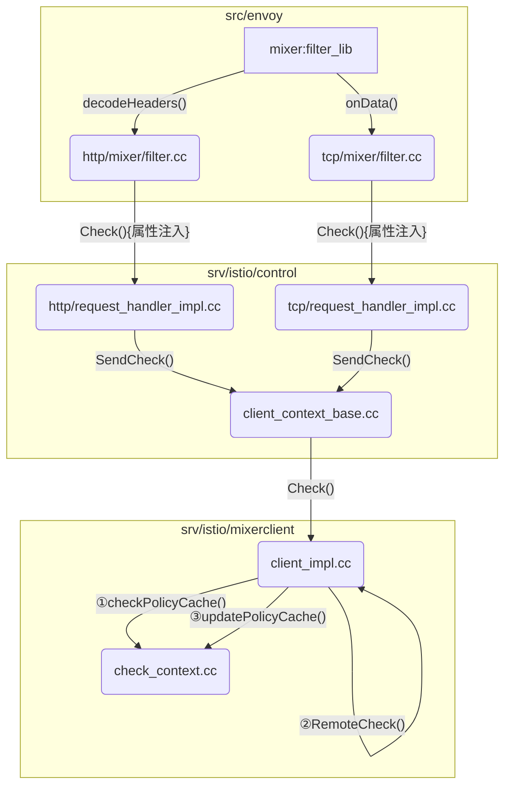

Mixer模块为Istio提供了模块化可扩展的组件，将策略与遥测进行抽象，通过配置模型进行配置。在[《【Istio】自定义 Mixer Adapter示例教程(附源码)》](http://hbchen.com/post/2019-03-05-custom-istio-mixer-adapter/)中介绍了如何自定义一个Adapter，本文通过`mxier`的源码分析，进一步了解适配器如何工作。
<!--more-->

Istio部署中有两个服务与`mixer`有关:`istio-policy`、`istio-telemetry`，分别负责策略与遥测，运行的都是`mixs`；另外`mixer`的Client端在Sidecar`istio-proxy`，竟像是`pilot-agent`，镜像中的`Envoy`是`istio/proxy`通过`Envoy`的`filter`扩展了`mixerclient`、`jwt_auth`、`authn`等功能。

> 
- github.com/istio/istio **release 1.1.0**
- github.com/istio/proxy **release 1.1.0**

## Mixer模块`mixs server`执行序列

```mermaid
sequenceDiagram
    participant s as server
    participant a as api
    participant r as runtime
    participant rd as runtine/dispatcher
    participant rc as runtime/config
    participant cs as config/store
    
    s ->> r: runtime.New()
    r -->> s: rt *Runtime
    s ->> r: p.runtimeListen(rt) —> rt.StartListening()
    r ->> cs: store.StartWatch()
    loop 配置监控 
    cs ->> cs: go func() { watchChan<-Event }
    end
    cs -->> r: <-watchChan
    
    loop 配置更新
    r ->> rc: go func() { WatchChanges(watchChan) }
    alt <-watchChan
    Note over rd,rc: <-watchChan Event先做堆积
    cs ->> cs: append(events, event)
    
    else <-timeChan
    Note over rd,rc: <-timeChan 计时器更新配置
    cs ->> r: onConfigChange()
    r ->> rc: ephemeral.ApplyEvent(events)
    rc ->> rc: entries Lock()，更新entries
    r ->> r: processNewConfig()
    r ->> rc: ephemeral.BuildSnapshot()
    Note right of rc: 创建配置快照<br/>entries RLock()<br/>......<br/>e.processRuleConfigs
    rc ->> rc: processXXXConfigs()
    rc -->> r: nweSnapshot *Snapshot
    Note right of r: 获得newHandlers
    r ->> r: handler.NewTable(nweSnapshot)
    Note right of r: 获得newRoutes
    r ->> r: routing.BuildTable(newHandlers, nweSnapshot)
    Note right of r: 更新RoutingContext
    r ->> rd: dispatcher.ChangeRoute(newRoutes)
    
    else <-stop
    Note over rd,rc: <-stop 退出goroutine
    cs -->> r: return
    end
    end
    
    r -->> s: nil or error
    s ->> a: api.NewGRPCServer(s.dispatcher)
    a -->> s: *MixerServer
    s ->> s: grpcServer.Serve()
    
    loop MixerServer
    activate a
    s ->> a: MixerServer Request
    Note right of a: Mixer服务逻辑
    a ->> rd: Check、Quota等调度
    activate rd
    rd ->> rd: session.dispatch()
    Note right of rd: 根据variety、ns筛选<br/>destinations
    rd ->> rd: s.rc.Routes.GetDestinations()
    Note right of rd: 等待Adapter调度完成
    rd ->> rd: s.waitForDispatched()
    rd -->> a: nil or error
    a -->> s: MixerServer Response
    deactivate rd
    deactivate s
    end
```

通过序列分析对`mixs server`有整体的了解，对`.yaml`配置逻辑的理解在`runtime/config/ephemeral.go`
```go
// BuildSnapshot builds a stable, fully-resolved snapshot view of the configuration.
func (e *Ephemeral) BuildSnapshot() (*Snapshot, error) {
	// ……
	
	// NOTE: e.entries中Kind为attributemanifest的属性，以及e.templates中Variety为TEMPLATE_VARIETY_ATTRIBUTE_GENERATOR生产的属性
	attributes := e.processAttributeManifests(monitoringCtx)
	
	// NOTE: e.entries中Kind为handler，且在e.adapters中有定义的Resource
	shandlers := e.processStaticAdapterHandlerConfigs(monitoringCtx)
	
	// NOTE: e.entries中Kind在e.templates中的Resource
	af := ast.NewFinder(attributes)
	instances := e.processInstanceConfigs(monitoringCtx, af, errs)
    
	// New dynamic configurations
	dTemplates := e.processDynamicTemplateConfigs(monitoringCtx, errs)
	dAdapters := e.processDynamicAdapterConfigs(monitoringCtx, dTemplates, errs)
	dhandlers := e.processDynamicHandlerConfigs(monitoringCtx, dAdapters, errs)
	dInstances := e.processDynamicInstanceConfigs(monitoringCtx, dTemplates, af, errs)
    
	// NOTE: 根据规则匹配默认及动态的handlers、instances配置
	rules := e.processRuleConfigs(monitoringCtx, shandlers, instances, dhandlers, dInstances, af, errs)
	// ……
}
```

## istio/proxy中`mixerclient`执行流程

- src/envoy/BUILD
    - http/mixer:filter_lib
    - tcp/mixer:filter_lib
- src/envoy/http、tcp/mixer/filter.cc
    - 分别在`decodeHeaders()`和`onData()`做`Check()`
- src/istio/control/http、tcp/request_handler_impl.cc
    - `Check()`先做属性注入
    - src/istio/control/client_context_base.cc，`SendCheck()`
        - 调用`mixerclient->Check()`
- src/istio/mixerclient/client_impl.cc
    - `Check()`先获取缓存`checkPolicyCache()`，缓存没有命中则走`RemoteCheck()`
    - `RemoteCheck()`成功后更新缓存`updatePolicyCache()`
    

