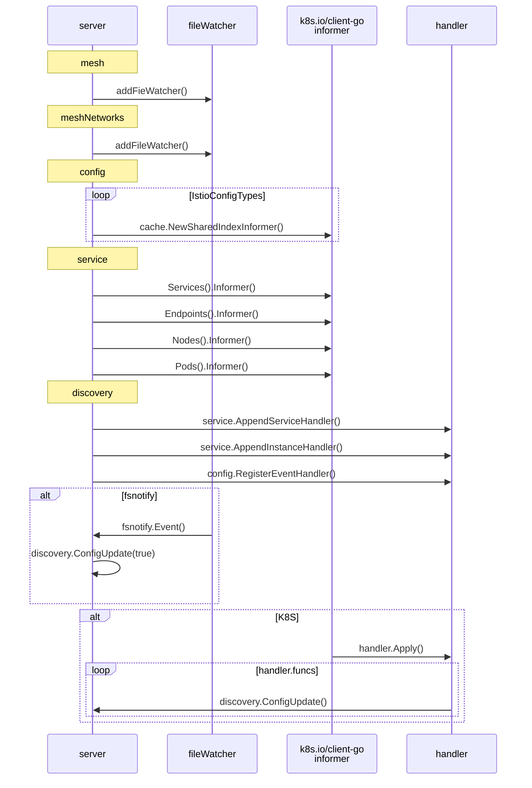
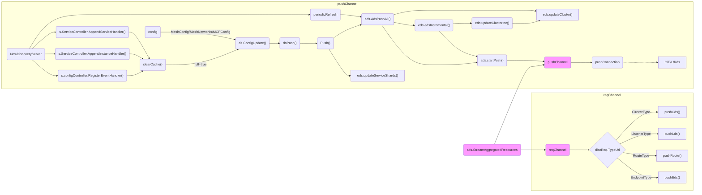

流量管理是网格的基础，Pilot负责三个主要功能：服务治理`istio-pilot`、Sidecar注入`istio-sidecar-injector`、以及Sidecar`istio-proxy`，
分别由三个模块负责：`pilot-discovery`、`sidecar-injector`、`pilot-agent`，这里从`pilot-discovery`开始。

## Discovery运行序列

### kube环境简化序列

### 详细序列

```mermaid
sequenceDiagram
    participant b as bootstrap
    participant kc as k8s.io/client-go
    participant cmd as cmd
    participant c as config/<br/>aggregate<br/>kube<br/>……
    
    participant k as kube
    participant m as model
    participant pe as proxy/envoy
    participant sr as serviceregistry
    
    
    b ->> b: NewServer()
    Note left of b: initKubeClient()
    b ->> k: kube.CreateClientset()
    k -->> b: kubeClient *kubernetes.Clientset
    
    Note left of b: 网格配置<br/>initMesh()
        Note over kc,cmd: 默认ConfigFile<br/>/etc/istio/config/mesh
        alt args.Mesh.ConfigFile != ""
        b ->> cmd: cmd.ReadMeshConfig(args.Mesh.ConfigFile)
        cmd -->> b: mesh *meshconfig.MeshConfig
        Note over b,c: ❤️❤️❤️️❤️️❤️<br/>️addFileWatcher(args.Mesh.ConfigFile)<br/>mesh reload<br/>✅s.EnvoyXdsServer.ConfigUpdate()
        else K8s ConfigMap 获取配置
        b ->> b: GetMeshConfig(s.kubeClient, kube.IstioNamespace, kube.IstioConfigMap)
        b ->> m: model.DefaultMeshConfig()/model.ApplyMeshConfigDefaults(cfgYaml)
        m -->> b: mesh meshconfig.MeshConfig
        end
    
    Note left of b: Mesh网络配置<br/>initMeshNetworks()
        Note over kc,cmd: 默认NetworksConfigFile<br/>/etc/istio/config/meshNetworks
        alt args.NetworksConfigFile != ""
        b ->> cmd: cmd.ReadMeshNetworksConfig()
        cmd -->> b: meshNetworks *meshconfig.MeshNetworks
        Note over b,c: ❤️❤️❤️️❤️️❤️<br/>addFileWatcher(args.NetworksConfigFile)<br/>meshNetworks reload<br/>✅s.EnvoyXdsServer.ConfigUpdate()
        end
    
    Note left of b: Mixer<br/>initMixerSan()
        alt s.mesh.DefaultConfig.ControlPlaneAuthPolicy == meshconfig.AuthenticationPolicy_MUTUAL_TLS
        b ->> pe: envoy.GetMixerSAN(args.Namespace)
        pe ->> b: SpiffeURI string
        Note over kc,cmd: s.mixerSAN[SpiffeURI]<br/>NewDiscoveryService的Env
        end
    
    Note left of b: 配置管理<br/>initConfigController()
        alt len(args.MCPServerAddrs) > 0 || len(s.mesh.ConfigSources) > 0
        Note over kc,cmd: s.initMCPConfigController()
            Note over kc,cmd: var clients []*client.Client<br/>var clients2 []*sink.Client<br/>var conns []*grpc.ClientConn<br/>var configStores []model.ConfigStoreCache
            loop s.mesh.ConfigSources
                alt url.Scheme == fsScheme
                b ->> c: memory.NewController(store)
                c -->> b: configController model.ConfigStoreCache
                Note over kc,cmd: configStores = append(configStores, configController)
                else
                b ->> c: coredatamodel.NewController()
                c -->> b: mcpController CoreDataModel
                Note over kc,cmd: clients = append(clients, mcpClient)<br/>clients2 = append(clients2, mcpClient2)<br/>mcpController是MCP Client的Updater<br/>当Client端收到Response时<br/>通过Updater.Apply()接口通知更新
                Note over kc,cmd: conns = append(conns, conn)<br/>configStores = append(configStores, mcpController)
                end
            end
            
            alt len(configStores) == 0
            Note over kc,cmd: ConfigSources未加载配置<br/>从MCPServerAddrs加载
            loop args.MCPServerAddrs
            b ->> c: coredatamodel.NewController()
            c -->> b: mcpController CoreDataModel
            Note over kc,cmd: conns = append(conns, conn)<br/>configStores = append(configStores, mcpController)
            end
            end
            
            
            Note over b,c: ❤️❤️❤️️❤️️❤️<br/>s.addStartFunc(go func() {client.Run(ctx)}())<br/>MCP Clients启动<br/>接收到Response通知mcpController<br/>Apply(*Change)<br/>model.ServiceEntry.Type的修改通知到serviceEntryEvents()<br/>❗在external.NewServiceDiscovery()有model.ServiceEntry.Type的handler
            Note over kc,cmd: 配置汇总
            b ->> c: configaggregate.MakeCache(configStores)
            c -->> b: aggregateMcpController model.ConfigStoreCache
            
        else args.Config.Controller != nil
        Note over kc,cmd: s.configController = args.Config.Controller
        else args.Config.FileDir != ""
        Note over kc,cmd: configController := memory.NewController(store)
        else 默认KubeConfig
        Note over kc,cmd: controller, err := s.makeKubeConfigController(args)
        end
        
        Note over b,c: ❤️❤️❤️️❤️️❤️<br/>s.addStartFunc ( go s.configController.Run(stop) )<br/>配置Controller启动<br/>处理配置变更的EventHandler<br/>memory、kube.crd的Controller有Run()实现
        Note over kc,cmd: memory通过makeFileMonitor()监控文件<br/>接收资源变更时更新configStore<br/>并通过monitor.ScheduleProcessEvent()分发事件<br/>❗RegisterEventHandler将handler Append到monitor的handlers
        Note over kc,cmd: kube.crd.cacheHandler运行informer<br/>informer监控不同ConfigType<br/>informer将资源Add、Update、Delete事件统一压入Queue<br/>Queue Run()逐个事件处理，即cacheHandler的hander.funcs<br/>❗RegisterEventHandler将handler Append到hander.funcs
        Note over b,c: 💚💚💚💚💚<br/>RegisterEventHandler()<br/><br/>❗在Discovery和ServiceRegistry有handler注册
        
        alt hasKubeRegistry(args) && s.mesh.IngressControllerMode != meshconfig.MeshConfig_OFF
        Note over kc,cmd: K8s ingress的ConfigController
        b ->> c: ingress.NewController()
        c -->> b: ingress model.ConfigStoreCache
        b ->> c: configaggregate.MakeCache(s.configController, ingress)
        c -->> b: configController model.ConfigStoreCache
        b ->> c: ingress.NewStatusSyncer()
        c -->> b: ingressSyncer *StatusSyncer
        Note over b,c: ❤️❤️❤️️❤️️❤️<br/>s.addStartFunc ( go ingressSyncer.Run(stop) )<br/>Ingress Syncer启动
        end
        b ->> m: model.MakeIstioStore(s.configController)
        m -->> b: istioConfigStore IstioConfigStore
        Note over b,c: 💚💚💚💚💚<br/>istioConfigStore提供Istio配置获取<br/>主要为ConfigStore的List()接口
    
    Note left of b: 服务注册<br/>initServiceControllers()
        b ->> sr: aggregate.NewController()
        sr -->> b: serviceControllers *Controller
        loop args.Service.Registries
        Note over b,c: 💚💚💚💚💚<br/>多注册中心<br/>Controller通过AppendServiceHandler()、AppendInstanceHandler()接收外部Handler<br/>在有变更时轮询Handler<br/>❗Discovery会AppendHandler
        alt serviceregistry.MockRegistry
        b ->> b: s.initMemoryRegistry()
        b ->> sr: srmemory.NewDiscovery() aggregate.Registry{}
        b -->> b: serviceControllers.AddRegistry()
        else serviceregistry.KubernetesRegistry
        b ->> b: s.createK8sServiceControllers()
        b ->> sr: kube.NewController()
        b -->> b: serviceControllers.AddRegistry()
        else serviceregistry.ConsulRegistry
        b ->> b: s.initConsulRegistry()
        b ->> sr: consul.NewController()
        b -->> b: serviceControllers.AddRegistry()
        else serviceregistry.MCPRegistry
        Note over kc,cmd: no-op: get service info from MCP ServiceEntries.
        end
        end
        b ->> sr: external.NewServiceDiscovery()
        sr -->> b: serviceEntryStore *ServiceEntryStore
        b -->> b: serviceControllers.AddRegistry()
        Note over b,c: ❤️❤️❤️️❤️️❤️<br/>s.addStartFunc()<br/>服务注册Controllers启动
    
    Note left of b: 服务发现<br/>initDiscoveryService()<br/>gRPC和HTTP服务
        b ->> pe: envoy.NewDiscoveryService()
        Note over b,c: 💚💚💚💚💚ds.clearCache()封装为Handler<br/>接收s.ServiceController、s.configController的变更通知<br/>✅s.ServiceController.AppendServiceHandler()<br/>✅s.ServiceController.AppendInstanceHandler()<br/>✅s.configController.RegisterEventHandler()
        pe -->> b: discovery *DiscoveryService
        Note over kc,cmd: HTTP<br/>envoy.DiscoveryService提供/v1/registration以及/debug/pprof/* REST接口
        b --> b: s.mux = discovery.RestContainer.ServeMux
        b ->> pe: envoyv2.NewDiscoveryServer()
        pe -->> b: s.EnvoyXdsServer *DiscoveryServer
        Note over kc,cmd: gRPC<br/>envoyv2.DiscoveryServer<br/>只提供StreamAggregatedResources()服务<br/>xDS管理
        Note over kc,cmd: s.initGrpcServer()<br/>s.httpServer<br/>http.Server{Handler: s.mux}        
        Note over kc,cmd: http listener<br/>grpc listener
        Note over b,c: ❤️❤️❤️️❤️❤️️s.addStartFunc()<br/>s.httpServer.Serve()<br/>s.grpcServer.Serve()
        alt args.DiscoveryOptions.SecureGrpcAddr != ""
        b ->> b: initSecureGrpcServer()
            Note over kc,cmd: s.secureGRPCServer<br/>s.secureHTTPServer
        Note over b,c: ❤️❤️❤️️❤️️❤️<br/>s.addStartFunc()<br/>s.secureHTTPServer.ServeTLS()
        end
        
        Note right of b: 
    
    Note left of b: 监控<br/>initMonitor()
        Note over b,c: ❤️❤️❤️️❤️️❤️<br/>s.addStartFunc()<br/>startMonitor()
    
    Note left of b: 集群<br/>initClusterRegistries()
        b ->> c: clusterregistry.NewMulticluster()
        c -->> b: multicluster *Multicluster
```

## Discovery Server流程

