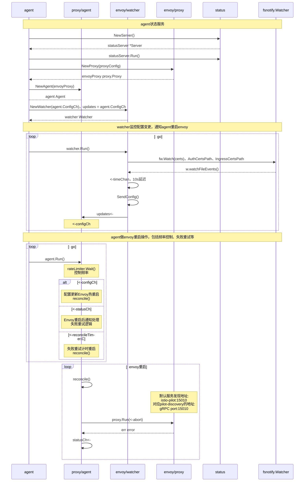

接上一篇[《【Istio源码】Pilot Discovery》](/post/servicemesh/2019-03-17-istio-code-pilot-discovery/)，这篇继续分析**Pilot**的`pilot-agent`模块。

<!--more-->
`pilot-agent`相对`pilot-discovery`在控制平面比较简单，**agent**更多的能力是在数据平面的`envoy`，`envoy`通过`xDS`协议与`pilot-discovery`服务进行通信。agent主要负责监控`ingress`、`mTLS`的证书，发生变更后重启`envoy`，以及提供**agent**状态的HTTP服务(*可选服务*)

