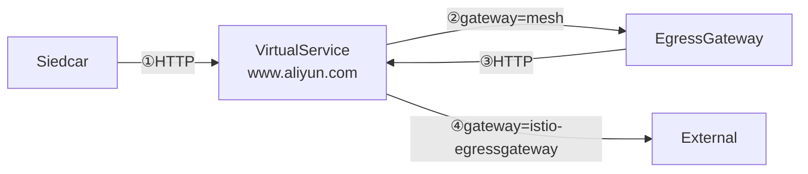
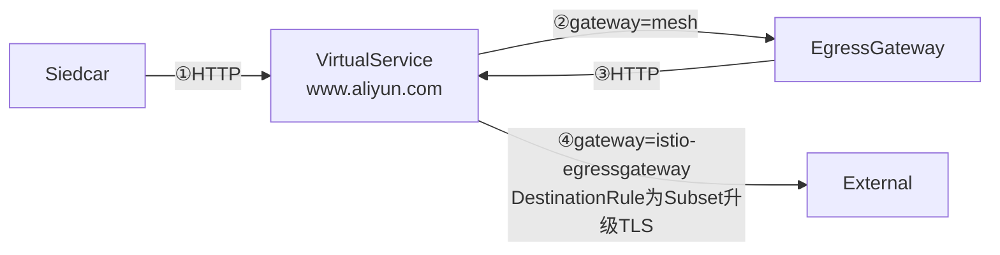

接上一篇《[【Istio安全】服务间访问控制-RBAC](/post/servicemesh/2019-03-09-istio-rbac-quick-start/)》，本文主要介绍网格边缘Egress相关的配置，`HTTP`、`HTTPS`以及`HTTP`转`TLS`。

<!--more-->

> 
- Istio版本 **1.1.1**

## 开始前的准备

>  
```yaml
  # Set the default behavior of the sidecar for handling outbound traffic from the application:
  # ALLOW_ANY - outbound traffic to unknown destinations will be allowed, in case there are no
  #   services or ServiceEntries for the destination port
  # REGISTRY_ONLY - restrict outbound traffic to services defined in the service registry as well
  #   as those defined through ServiceEntries
  # ALLOW_ANY is the default in 1.1.  This means each pod will be able to make outbound requests 
  # to services outside of the mesh without any ServiceEntry.
  # REGISTRY_ONLY was the default in 1.0.  If this behavior is desired, set the value below to REGISTRY_ONLY.
  outboundTrafficPolicy:
    mode: ALLOW_ANY
```
   
Istio部署配置的`global.outboundTrafficPolicy`参数，在1.1开始默认`ALLOW_ANY`，这种情况下如果不配置`ServiceEntry`，访问外包HTTP流量返回`404`，而HTTPS流量可以正常访问，为了测试`ServiceEntry`配置效果，将配置改为`REGISTRY_ONLY`，方便观察`ServiceEntry`配置的效果

> 本文示例Istio使用helm的values-istio-demo.yaml配置安装

部署测试用例`sleep`
```bash
$ kubectl apply -f https://raw.githubusercontent.com/istio/istio/release-1.1/samples/sleep/sleep.yaml

$ export SOURCE_POD=$(kubectl get pod -l app=sleep -o jsonpath={.items..metadata.name})
```

**访问测试**`outboundTrafficPolicy=ALLOW_ANY`
```bash
$ kubectl exec -it $SOURCE_POD -c sleep -- curl -sL -o /dev/null -D - http://hbchen.com
HTTP/1.1 404 Not Found

$ kubectl exec -it $SOURCE_POD -c sleep -- curl -sL -o /dev/null -D - http://www.aliyun.com
HTTP/1.1 404 Not Found

$ kubectl exec -it $SOURCE_POD -c sleep -- curl -sL -o /dev/null -D - https://www.aliyun.com
HTTP/2 200
```

修改`values-istio-demo.yaml`
```yaml
  outboundTrafficPolicy:
    mode: REGISTRY_ONLY
```
重新部署Istio
```bash
$ helm template install/kubernetes/helm/istio --name istio --namespace istio-system --values install/kubernetes/helm/istio/values-istio-demo.yaml | kubectl apply -f -
```

重新部署测试用例`sleep`
```bash
$ kubectl delete -f https://raw.githubusercontent.com/istio/istio/release-1.1/samples/sleep/sleep.yaml
$ kubectl apply -f https://raw.githubusercontent.com/istio/istio/release-1.1/samples/sleep/sleep.yaml

$ export SOURCE_POD=$(kubectl get pod -l app=sleep -o jsonpath={.items..metadata.name})
```

## Sidecar方式


### HTTP

先定义一个`ServiceEntry`，开启`www.aliyun.com`、`hbchen.com`的外部访问
```yaml
$ kubectl apply -f - <<EOF
apiVersion: networking.istio.io/v1alpha3
kind: ServiceEntry
metadata:
  name: entry-x
spec:
  hosts:
  - www.aliyun.com
  - hbchen.com
  ports:
  - number: 80
    name: http
    protocol: HTTP
  resolution: NONE
EOF
```

**访问测试**
```bash
$ kubectl exec -it $SOURCE_POD -c sleep -- curl -sL -o /dev/null -D - http://hbchen.com
HTTP/1.1 200 OK

$ kubectl exec -it $SOURCE_POD -c sleep -- curl -sL -o /dev/null -D - http://www.aliyun.com
HTTP/1.1 301 Moved Permanently
...
command terminated with exit code 35

$ kubectl exec -it $SOURCE_POD -c sleep -- curl -sL -o /dev/null -D - https://www.aliyun.com
command terminated with exit code 35
```

### HTTP & HTTPS
只开`80`端口，`HTTP`正常，而对于`HTTPS`以及有`HTTP`重定向`HTTPS`的请求仍会失败`command terminated with exit code 35`，所以实践中外部服务一般同时开启`80`、`443`端口

```yaml
$ kubectl apply -f - <<EOF
apiVersion: networking.istio.io/v1alpha3
kind: ServiceEntry
metadata:
  name: entry-x
spec:
  hosts:
  - www.aliyun.com
  - hbchen.com
  ports:
  - number: 80
    name: http-port
    protocol: HTTP
  - number: 443
    name: https-port
    protocol: HTTPS
  resolution: NONE
EOF
```

**访问测试**
```bash
$ kubectl exec -it $SOURCE_POD -c sleep -- curl -sL -o /dev/null -D - http://www.aliyun.com
HTTP/1.1 301 Moved Permanently
...
HTTP/2 200

$ kubectl exec -it $SOURCE_POD -c sleep -- curl -sL -o /dev/null -D - https://www.aliyun.com
HTTP/2 200
...
```

### HTTP转TLS
这时我们看到另一个问题，需要升级`HTTPS`的`HTTP`请求每次都要`301`重定向一次，在不修改代码的情况下可以在`proxy`将`HTTP`请求升级为`TLS`，避免二次跳转，需要加`VirtualService` + `DestinationRule`来实现。

在官方示例[出口流量的-tls](https://istio.io/zh/docs/examples/advanced-gateways/egress-tls-origination/#%E5%87%BA%E5%8F%A3%E6%B5%81%E9%87%8F%E7%9A%84-tls)中，仅将`HTTP`升级到`TLS`，而对正常的`HTTPS`没有支持，这里稍作改动，在`VirtualService`中为`80`端口的`destination`定义`subset`，这样在`DestinationRule`中默认`trafficPolicy`不做处理，仅对指定的`subset`做`HTTPS`转发，使网格内无论发起`HTTP`还是`HTTPS`的外网请求都可以正常访问。

```yaml
kubectl apply -f - <<EOF
apiVersion: networking.istio.io/v1alpha3
kind: ServiceEntry
metadata:
  name: entry-x
spec:
  hosts:
  - www.aliyun.com
  - hbchen.com
  ports:
  - number: 80
    name: http-port
    protocol: HTTP
  - number: 443
    name: https-port
    protocol: HTTPS
  resolution: DNS
  location: MESH_EXTERNAL
---
apiVersion: networking.istio.io/v1alpha3
kind: VirtualService
metadata:
  name: rewrite-port-for-entry
spec:
  hosts:
  - www.aliyun.com
  http:
  - match:
      - port: 80
    route:
    - destination:
        # NOTE: 为HTTP升级流量指定subset
        subset: originate-tls
        host: www.aliyun.com
        port:
          number: 443
  tls:
  - match:
      - port: 443
        sniHosts:
        - www.aliyun.com
    route:
    - destination:
        host: www.aliyun.com
        port:
          number: 443
---
apiVersion: networking.istio.io/v1alpha3
kind: DestinationRule
metadata:
  name: originate-tls-for-entry
spec:
  host: www.aliyun.com
  trafficPolicy:
    loadBalancer:
      simple: ROUND_ROBIN
  subsets:
    - name: originate-tls
      trafficPolicy:
        loadBalancer:
          simple: ROUND_ROBIN
        portLevelSettings:
        - port:
            number: 443
          tls:
            mode: SIMPLE
EOF
```

**访问测试**
```bash
$ kubectl exec -it $SOURCE_POD -c sleep -- curl -sL -o /dev/null -D - http://hbchen.com
HTTP/1.1 200 OK

$ kubectl exec -it $SOURCE_POD -c sleep -- curl -sL -o /dev/null -D - http://www.aliyun.com
HTTP/1.1 200 OK

$ kubectl exec -it $SOURCE_POD -c sleep -- curl -sL -o /dev/null -D - https://www.aliyun.com
HTTP/2 200
```


## Gateway方式


> 官方示例[配置 Egress gateway](https://istio.io/zh/docs/examples/advanced-gateways/egress-gateway/)

Gateway与Sidecar的区别是将出口流量都转到`egressgateway`，再由Gateway进行转发处理，无论Gateway还是Sidecar`ServiceEntry`的配置规则都是需要的，这里我们直接开启`80`、`433`，注意`resolution`=`DNS`
```yaml
apiVersion: networking.istio.io/v1alpha3
kind: ServiceEntry
metadata:
  name: entry-x
spec:
  hosts:
  - www.aliyun.com
  ports:
  - number: 80
    name: http-port
    protocol: HTTP
  - number: 443
    name: https-port
    protocol: HTTPS
  resolution: DNS
```

*访问测试（略）*

### HTTP
流程如下



```yaml
kubectl apply -f - <<EOF
apiVersion: networking.istio.io/v1alpha3
kind: Gateway
metadata:
  name: istio-egressgateway
spec:
  selector:
    istio: egressgateway
  servers:
  - port:
      number: 80
      name: http-port
      protocol: HTTP
    hosts:
    - www.aliyun.com
---
apiVersion: networking.istio.io/v1alpha3
kind: DestinationRule
metadata:
  name: egressgateway-for-aliyun
spec:
  host: istio-egressgateway.istio-system.svc.cluster.local
  subsets:
  - name: aliyun
---
apiVersion: networking.istio.io/v1alpha3
kind: VirtualService
metadata:
  name: aliyun-through-egress-gateway
spec:
  hosts:
  - www.aliyun.com
  gateways:
  - istio-egressgateway
  - mesh
  http:
  - match:
    - gateways:
      - mesh
      port: 80
    route:
    - destination:
        host: istio-egressgateway.istio-system.svc.cluster.local
        subset: aliyun
        port:
          number: 80
      weight: 100
  - match:
    - gateways:
      - istio-egressgateway
      port: 80
    route:
    - destination:
        host: www.aliyun.com
        port:
          number: 80
      weight: 100
EOF
```

**访问测试**(*这里只有HTTP*)
```bash
kubectl exec -it $SOURCE_POD -c sleep -- curl -sL -o /dev/null -D - http://www.aliyun.com
HTTP/1.1 301 Moved Permanently
...
HTTP/2 200
...
```

### HTTP转TLS


与Sidecar方式类似，对于有`HTTP`重定向到`HTTPS`的流量可以在Gateway代理直接升级为`TLS`，减少跳转，实现方式与Sidecar方式类似，为`HOST`增加`DestinationRule`规则为`HTTP`流量发起`TLS`请求。

```yaml
kubectl apply -f - <<EOF
apiVersion: networking.istio.io/v1alpha3
kind: Gateway
metadata:
  name: istio-egressgateway
spec:
  selector:
    istio: egressgateway
  servers:
  - port:
      number: 80
      name: http-port
      protocol: HTTP
    hosts:
    - www.aliyun.com
---
apiVersion: networking.istio.io/v1alpha3
kind: DestinationRule
metadata:
  name: egressgateway-for-aliyun
spec:
  host: istio-egressgateway.istio-system.svc.cluster.local
  subsets:
  - name: aliyun
---
apiVersion: networking.istio.io/v1alpha3
kind: VirtualService
metadata:
  name: aliyun-through-egress-gateway
spec:
  hosts:
  - www.aliyun.com
  gateways:
  - istio-egressgateway
  - mesh
  http:
  - match:
    - gateways:
      - mesh
      port: 80
    route:
    - destination:
        host: istio-egressgateway.istio-system.svc.cluster.local
        subset: aliyun
        port:
          number: 80
      weight: 100
  - match:
    - gateways:
      - istio-egressgateway
      port: 80
    route:
    - destination:
        host: www.aliyun.com
        # NOTE: 为HTTP升级流量指定subset
        subset: originate-tls
        port:
          number: 443
      weight: 100
---
# NOTE: 注意这里与Sidecar方式类似，需要对HTTP流量单独配置subset，否则影响正常HTTPS流量
apiVersion: networking.istio.io/v1alpha3
kind: DestinationRule
metadata:
  name: originate-tls-for-aliyun
spec:
  host: www.aliyun.com
  trafficPolicy:
    loadBalancer:
      simple: ROUND_ROBIN
  subsets:
    - name: originate-tls
      trafficPolicy:
        loadBalancer:
          simple: ROUND_ROBIN
        portLevelSettings:
        - port:
            number: 443
          tls:
            mode: SIMPLE
EOF
```

**访问测试**
```bash
$ kubectl exec -it $SOURCE_POD -c sleep -- curl -sL -o /dev/null -D - http://www.aliyun.com
HTTP/1.1 200 OK
```

> 双向`TLS`、`HTTTPS`透传等这里没有再做测试，有兴趣可以参考官方示例[配置 Egress gateway](https://istio.io/zh/docs/examples/advanced-gateways/egress-gateway/) 


## 直接调用外部服务


> Istio文档[直接调用外部服务](https://istio.io/zh/docs/tasks/traffic-management/egress/#%E7%9B%B4%E6%8E%A5%E8%B0%83%E7%94%A8%E5%A4%96%E9%83%A8%E6%9C%8D%E5%8A%A1)

需要修改helm的values配置更新部署。并且要让新的`istio-sidecar-injector`生效，重新部署`sleep`用例。这种方式在Sidecar的Proxy中跳过了外部IP，虽然也有`excludeIPRanges`方式，但修改麻烦需要更新sidecar，并且这样也失去了Istio的其它能力，所以不怎么实用。
```yaml
  proxy:
    # Minikube
    includeIPRanges: "10.0.0.1/24"
```

## 总结
`ServiceEntry`配合`VirtualService`、`DestinationRule`可以使外部流量做比较灵活的管控，并且可以对外部服务使用流量管理的相关功能，Gateway相对Sidecar配置还是略显复杂，而在性能方面官方Blog[Egress gateway 性能测试](https://istio.io/zh/blog/2019/egress-performance/)给出的比较结果两者相差不大，至于直接调用方式相对就不怎么实用了。